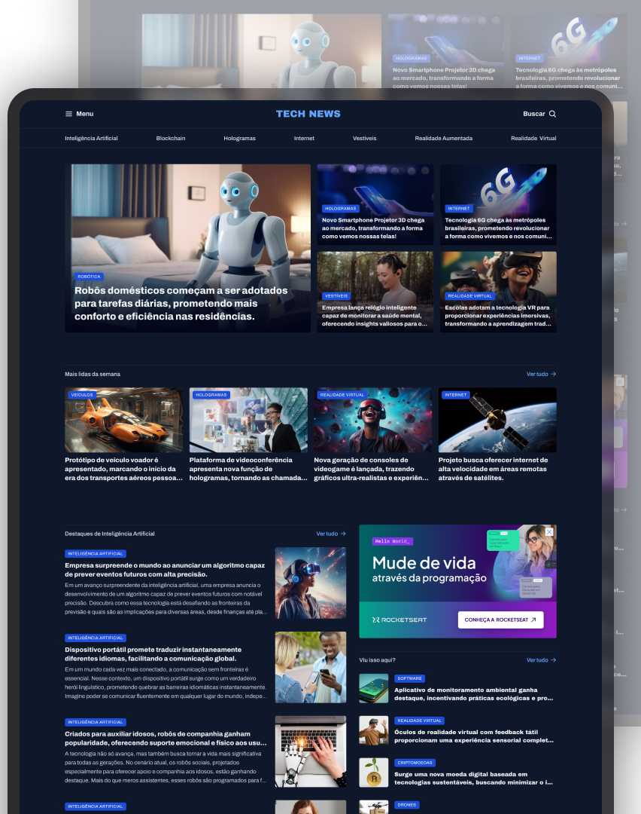

<h1 align="center"> Portal de Notícias </h1>
    

    

## Sobre
Projeto estático de um portal de notícias construído com HTML e CSS. O layout apresenta seções de destaque, mais lidas da semana, artigos sobre inteligência artificial e uma barra lateral com anúncios e conteúdo complementar.

## 🚀 Tecnologias
- HTML5
- CSS3

## Como executar
1. Clone este projeto ou copie os arquivos para sua máquina.
2. Abra o arquivo `index.html` no navegador.
3. Opcional: use Live Server no VS Code para visualizar localmente.

## Estrutura das pastas
- `index.html` - Página principal com o markup do portal
- `styles/` - Pastas com os estilos CSS
- `global.css` - Estilos base, variáveis e grid geral da página
- `headder.css` - Estilos do cabeçalho e navegação
- `index.css` - Importação dos estilos e configuração inicial
- `sections.css` - Estilos das seções do conteúdo principal
- `assets/` - Imagens, ícones e outros recursos visuais utilizados no layout

## Funcionalidades
- Layout com navegação superior e categorias de notícias
- Seção de destaque com cartão principal e cards secundários
- Área "Mais lidas da semana" com cards de notícias recentes
- Seção de destaques de Inteligência Artificial com artigos e imagens
- Barra lateral com anúncio e conteúdo complementar de interesse

## 💻 Projeto
- [Acesse o projeto finalizado, online.](https://vkoithi.github.io/portal-noticia/)

